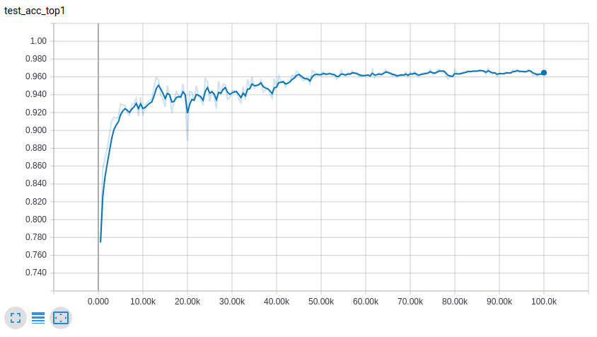

# VAE-GAN

This repo implements many recently emerged generative models, such as GAN, VAE, DCGAN, WGAN, WGAN-GP, and some semi-supervised model such as AAE, SemiDGM, this code is just for learning the generative models and for fast developing algorithms. 

There is some problem with my code, for WGAN, I found it very likely to cause model collpase(after 30k iters on Cifar10 dataset) and the generated sample quality goes worse. For semi-supervised model AAE, I achieved 96% accuracy on MNIST dataset with 10 labels per class which is below the paper claimed accuracy 98.1%. I will keep refining this repo to support more generative and semi-supervised algorithms.

Some code is outdated and may cause bug in running, please email to me: yznzhicong1069163331@outlook.com

*****

this code is running with python3 and tensorflow1.9.0 on both Windows and Ubuntu

*****

# Currently Implemented Models

## GAN

[DCGAN](http://arxiv.org/abs/1511.06434)

[Improved-GAN](http://arxiv.org/abs/1606.03498)

[WGAN-GP](http://arxiv.org/abs/1704.00028)

## VAE

[VAE]()

[AAE](http://arxiv.org/abs/1511.05644)

*****

# Training

before training, you must specify the dataset location. the currently supported dataset is
1. MNIST
2. Cifar10
3. Imagenet
4. PASCAL_VOC
open the py file under dataset folder, for each dataset I write some if control flow to find the dataset location. please add the dataset location to the control flow.

the config files is under the cfgs folder, I write config file in json format, the dataset, model and train method are all specified in this file. you can train it with train.py. If you want to run the models, just run the following command:

    python(3) train.py --config=<config file>  --gpu=<your gpu number>

the "assets dir" in config file is the folder where the result stores. the tensorboard log file is under the 'log' folder

# Result

## AAE Semi-supervised Classification with 100 labels

    python3 train.py --config=aae/mnist_ssl 

